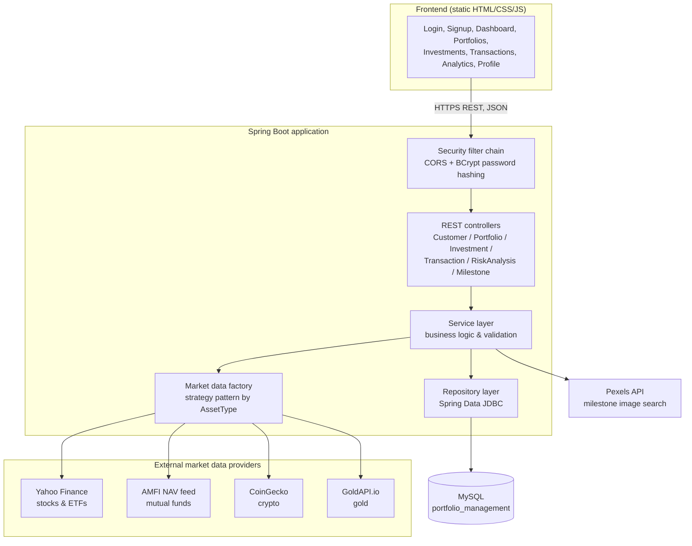

# Portfolio Manager — High Level Design (HLD) Documentation

**Project:** Portfolio Manager
**Type:** Full-stack investment portfolio management system
**Backend:** Java 17, Spring Boot 4.0.7 (Spring MVC, Spring Security, Spring Data JDBC)
**Frontend:** Static HTML/CSS/JavaScript SPA-style pages
**Database:** MySQL (`portfolio_management`)

---

## 1. Purpose

The system lets a customer register/log in, create investment portfolios, add and track individual investments (stocks, ETFs, mutual funds, gold, crypto, and other assets), log buy/sell transactions, and view portfolio-level risk analysis — with live prices pulled from external market data providers. Customers can also set **financial milestones** (savings goals tied to a target item and price) and track progress toward each one using their accumulated investment profit.

---

## 2. Architecture Overview

---

## 3. Component Breakdown

### 3.1 Frontend (`/frontend`)
Static pages served independently of the backend (no server-side templating):
- `login.html`, `signup.html` — authentication
- `dashboard.html` — portfolio summary
- `portfolios.html`, `investments.html`, `add-investment.html` — portfolio & holdings management
- `transactions.html` — buy/sell transaction history
- `analytics.html` — risk/return analysis views
- `profile.html` — customer profile, password change, data export/delete
- JS modules under `frontend/js/`: `api.js` (HTTP client), `auth.js`, `dashboard.js`, `portfolio.js`, `investment.js`, `transaction.js`, `analytics.js`, `profile.js`

The frontend talks to the backend purely over REST/JSON, cross-origin (backend allows `localhost:5500` / `127.0.0.1:5500` via CORS).

### 3.2 API layer (`controller/`)
| Controller | Base path | Responsibility |
|---|---|---|
| `CustomerController` | `/api/customers` | register, login, profile CRUD, password change, profile summary/export, admin list |
| `PortfolioController` | `/api/portfolios` | CRUD for customer portfolios |
| `InvestmentController` | `/api/investments` | CRUD for holdings, CSV/Excel import & export, live exchange rate lookup |
| `InvestmentTransactionController` | `/api/transactions` | record and list buy/sell transactions, import/export |
| `RiskAnalysisController` | `/api/risk-analysis` | per-stock and per-portfolio risk metrics |
| `MilestoneController` | `/api/milestones` | create/update/delete/reorder financial goals, fetch next milestone with progress |

### 3.3 Security (`config/SecurityConfig.java`)
- Stateless Spring Security filter chain, CSRF disabled (pure REST API)
- CORS restricted to configured frontend origins, credentials allowed
- `BCryptPasswordEncoder` bean used for password hashing
- **Note:** the current filter chain permits all requests (`anyRequest().permitAll()`) — authentication is handled at the service/controller level rather than via a security filter (e.g. login endpoint checks BCrypt hash directly). Worth flagging in documentation as an area to review before production hardening (e.g. adding token-based auth/authorization).

### 3.4 Service layer (`service/`)
- `CustomerService` — registration, login, profile management
- `PortfolioService` — portfolio CRUD, ownership checks
- `InvestmentService` — holdings CRUD, valuation, CSV/Excel import via `TabularDataService`
- `InvestmentTransactionService` — transaction recording, recalculates holding positions
- `RiskAnalysisService` — computes risk metrics (uses configured risk-free rate)
- `SymbolResolverService` — resolves ticker/scheme symbols across asset types
- `CurrencyConversionService` — FX conversion between supported currencies
- `TabularDataService` — CSV (Apache Commons CSV) and Excel (Apache POI) import/export
- `MilestoneService` — CRUD and reordering for customer financial goals; computes goal progress from total investment profit and auto-fetches a representative image for each goal via the Pexels API

### 3.5 Market data integration (`marketdata/`)
Implements a **strategy/factory pattern**:
- `MarketDataService` — interface, each implementation declares which `AssetType`s it supports (`STOCK`, `ETF`, `MUTUAL_FUND`, `GOLD`, `CRYPTO`, `OTHER`)
- `MarketDataFactory` — registers all `MarketDataService` beans at startup and routes a request to the correct implementation by asset type
- Implementations (`marketdata/impl/`):
  - `AmfiMarketDataService` — mutual fund NAVs from the AMFI feed (via `RestTemplate`)
  - `CryptoMarketDataService` — crypto prices via CoinGecko (via `RestTemplate`)
  - `GoldMarketDataService` — gold prices via GoldAPI.io (configured via `gold.api.baseUrl` / `gold.api.key`)
- `YahooFinanceService` (in `service/`) — stock/ETF prices from Yahoo Finance, also implements `MarketDataService`

### 3.6 Milestones / financial goals (`entity/Milestone.java`, `service/MilestoneService.java`)
New feature letting a customer set savings goals and track progress funded by their investment gains:
- A milestone has an `item` (goal name), a target `price`, an `imageUrl`, and a `displayOrder` (drag-reorderable).
- `MilestoneService` computes progress by summing the customer's total profit across all investments (`MilestoneRepository.getTotalProfitByCustomerId`) and comparing it against the milestone's target price — producing `completedAmount`, `progressPercentage`, `remainingAmount`, and an `achieved` flag.
- `GET /api/milestones/next` returns the single closest not-yet-achieved milestone, useful for a "next goal" dashboard widget.
- On creation, if no image is supplied, the service calls the **Pexels API** (`pexels.api.key` / `pexels.api.base-url` in `application.properties`) to search for and attach a representative photo for the goal item, falling back to a default stock image if the lookup fails or the key is missing.
- All endpoints resolve the acting customer via `CustomerService.resolveCustomerId(authentication, headerCustomerId)`, the same pattern used elsewhere in the app.

### 3.7 Data layer (`repository/`, `entity/`)
Spring Data JDBC repositories: `CustomerRepository`, `PortfolioRepository`, `InvestmentRepository`, `InvestmentTransactionRepository`, `MilestoneRepository`, backed by MySQL.

**Core entities / data model:**
- **Customer** — customerId, customerName, username, passwordHash, email, phoneNumber
- **Portfolio** — portfolioId, customerId, portfolioName
- **Investment** — investmentId, portfolioId, symbol/schemeCode, companyName, exchange, currency, assetType, quantity, investedAmount, purchasePrice, currentPrice, currentValue, profitLoss, purchaseDate
- **InvestmentTransaction** — transactionId, investmentId, symbol, companyName, assetType, transactionDate, transactionType (buy/sell), quantity, transactionPrice, transactionAmount
- **Milestone** — milestoneId, customerId, item, price, imageUrl, displayOrder

Relationships: `Customer 1—* Portfolio 1—* Investment 1—* InvestmentTransaction` and `Customer 1—* Milestone` (independent of portfolios — driven off aggregate profit, not a specific holding)

### 3.8 Cross-cutting concerns
- `exception/` — centralized error handling via `GlobalExceptionHandler` and typed exceptions (`CustomerNotFoundException`, `PortfolioNotFoundException`, `InvestmentNotFoundException`, `TransactionNotFoundException`, `DuplicateResourceException`, `InvalidCredentialsException`, `MarketDataException`, `YahooFinanceException`, `ResourceNotFoundException`)
- `dto/` — request/response DTOs decoupling the API contract from entities
- API documentation exposed via springdoc-openapi (Swagger UI)

---

## 4. Data Flow (typical request)

1. User action in the frontend triggers a `fetch` call from `api.js` to a REST endpoint.
2. Request passes through the Spring Security filter chain (CORS check, no auth gate currently enforced at the filter level).
3. Controller validates input (via DTOs) and delegates to the relevant service.
4. Service applies business rules, and either:
   - reads/writes via the repository layer to MySQL, and/or
   - calls `MarketDataFactory.getService(assetType)` to fetch a live price from the matching external provider.
5. Response DTO is serialized back to JSON and returned to the frontend, which updates the UI.

For milestone operations specifically, the service instead cross-references the customer's aggregate investment profit (via a repository-level SQL aggregate) and, on creation, may call out to the Pexels API to resolve a goal image before persisting.

---

## 5. Technology Stack

| Layer | Technology |
|---|---|
| Language / runtime | Java 17 |
| Framework | Spring Boot 4.0.7 (Spring MVC, Spring Security) |
| Persistence | Spring Data JDBC, MySQL (`mysql-connector-j`) |
| API docs | springdoc-openapi (Swagger UI) |
| Password hashing | BCrypt (`spring-security-crypto`) |
| File import/export | Apache Commons CSV, Apache POI (Excel) |
| Frontend | Static HTML/CSS/JavaScript |
| Build tool | Maven (`mvnw`) |
| External APIs | Yahoo Finance, AMFI NAV feed, CoinGecko, GoldAPI.io, Pexels (milestone images) |

---

## 6. Deployment View

- Single Spring Boot application, packaged as an executable JAR (`spring-boot-maven-plugin`), default port `8080`.
- Connects to a MySQL instance (`portfolio_management` schema, set up via `DatabaseSetup.sql`).
- Frontend is served as static files independently (e.g. via a local dev server on port 5500) and talks to the backend over CORS-enabled REST.
- External API keys/URLs (e.g. GoldAPI) are configured via `application.properties`.

---

## 7. Notes for Review

- CORS origins and the "permit all" security rule are currently scoped for local development — revisit before any production deployment.
- Secrets (DB password, GoldAPI key, Pexels API key) are currently in plain `application.properties` — recommend externalizing via environment variables or a secrets manager for production.

