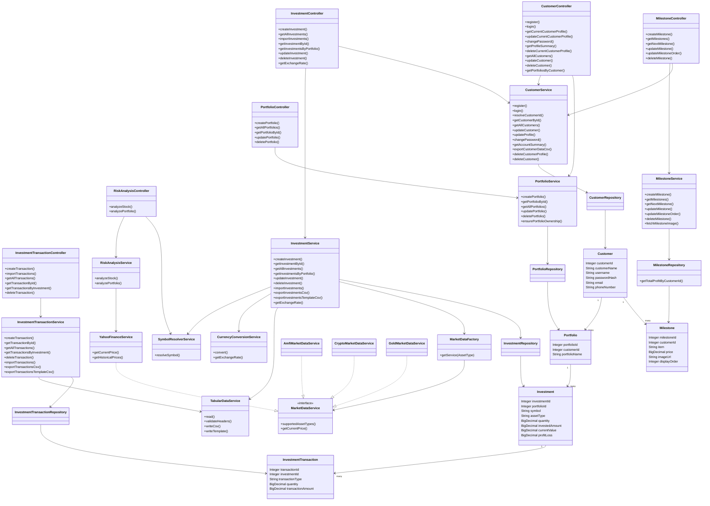
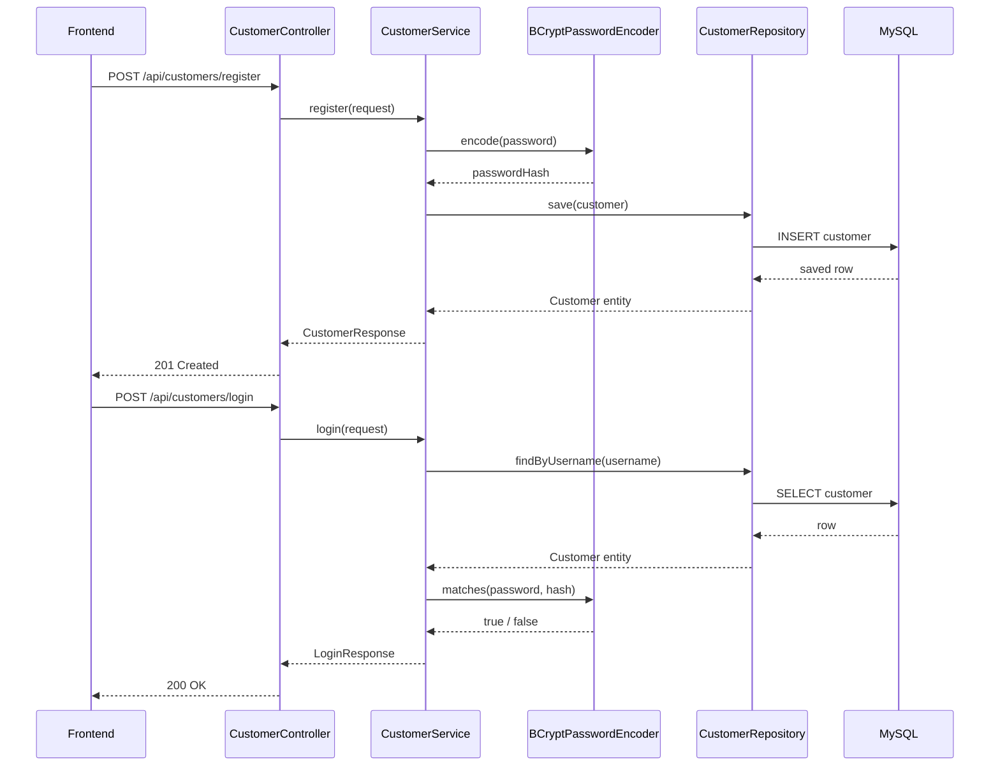
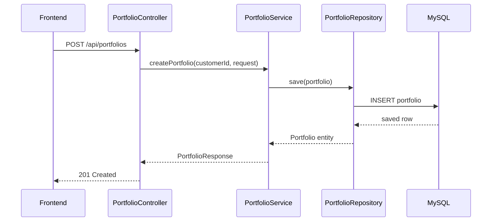
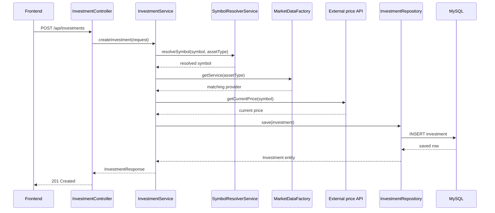
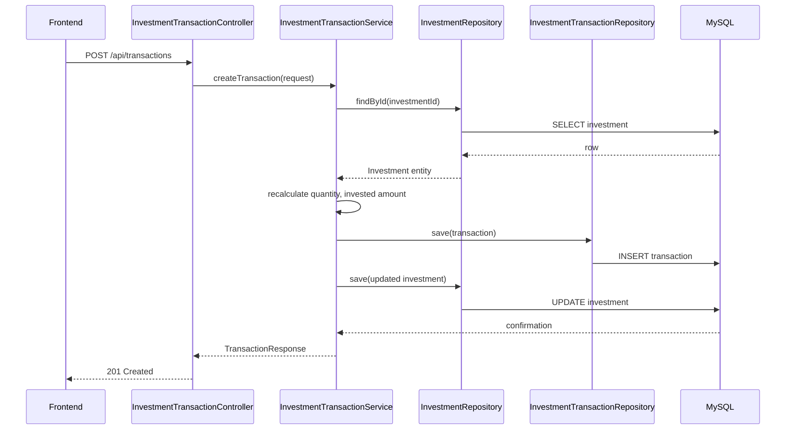
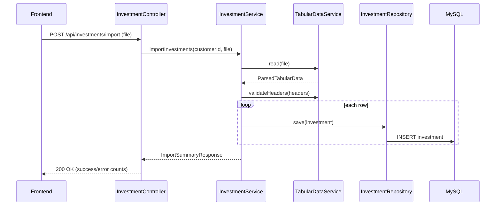
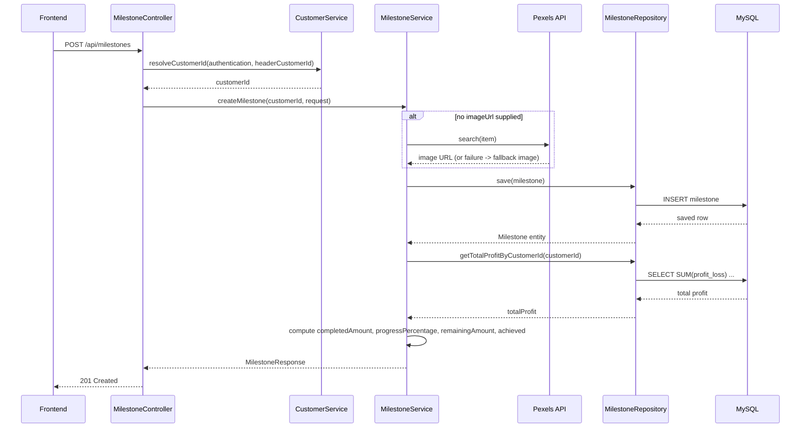
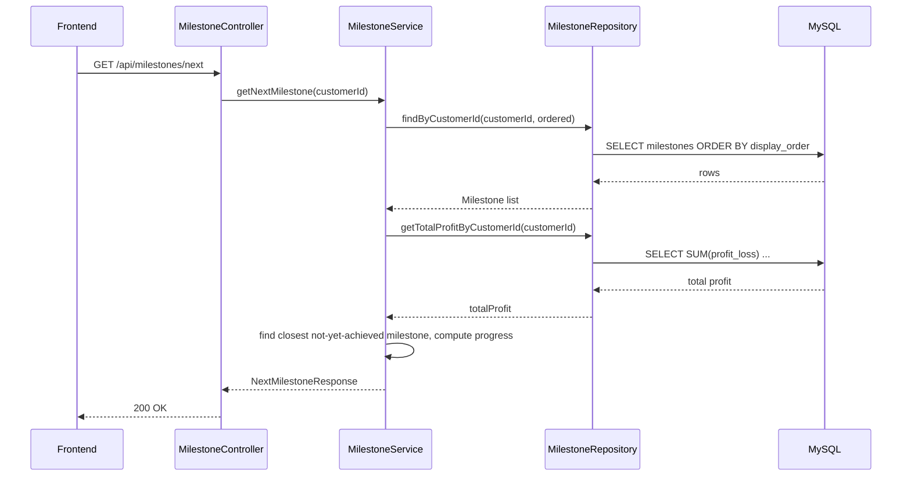
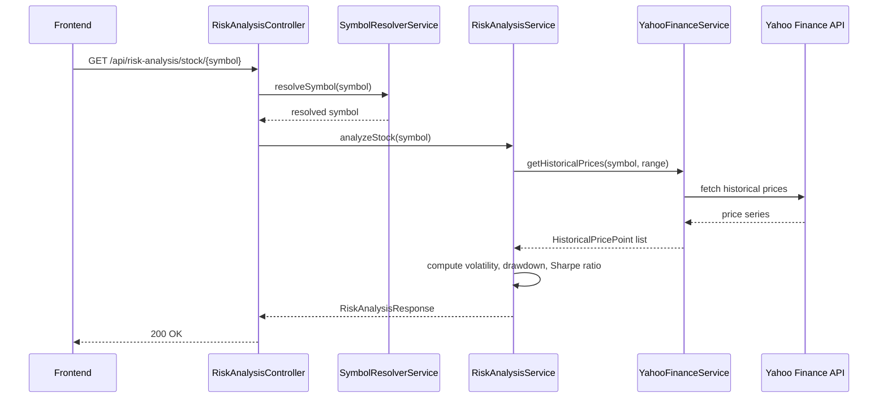

# Portfolio Manager — UML Documentation

Covers the full class structure (with operations) and the request flow for every major operation in the system, including the newly added **Milestone (financial goals)** feature. All diagrams are in Mermaid syntax — paste into any Mermaid-compatible viewer (GitHub/GitLab markdown, Mermaid Live Editor, VS Code Mermaid extension, Confluence, etc.) to render.

---

## 1. Class Diagram (structure + operations)

---

## 2. Operation flows (sequence diagrams)

### 2.1 Register / Login

### 2.2 Create portfolio

### 2.3 Add investment (live price lookup)

### 2.4 Record transaction (buy/sell)

### 2.5 Import investments/transactions (CSV/Excel)

### 2.6 Create milestone (financial goal) with image lookup

### 2.7 Get next milestone (progress tracking)

### 2.8 Risk analysis

---

## 3. Notes

- All controller-level operations delegate straight to a matching service method — there is no logic in the controllers beyond request/response mapping.
- `InvestmentService` and `RiskAnalysisService` are the two integration points that reach out to external market data — everything else stays inside the backend and MySQL. `MilestoneService` is a third, separate integration point (Pexels, for goal images) that has no bearing on pricing.
- Import/export operations reuse a single shared `TabularDataService` for both investments and transactions, rather than each having its own CSV/Excel logic.
- The `Milestone` feature (`MilestoneController` → `MilestoneService` → `MilestoneRepository` → `Milestone` entity) lets a customer define savings goals and tracks progress against their total investment profit, independent of any single portfolio or holding. Every milestone endpoint resolves the acting customer the same way as other controllers, via `CustomerService.resolveCustomerId(authentication, headerCustomerId)`.
