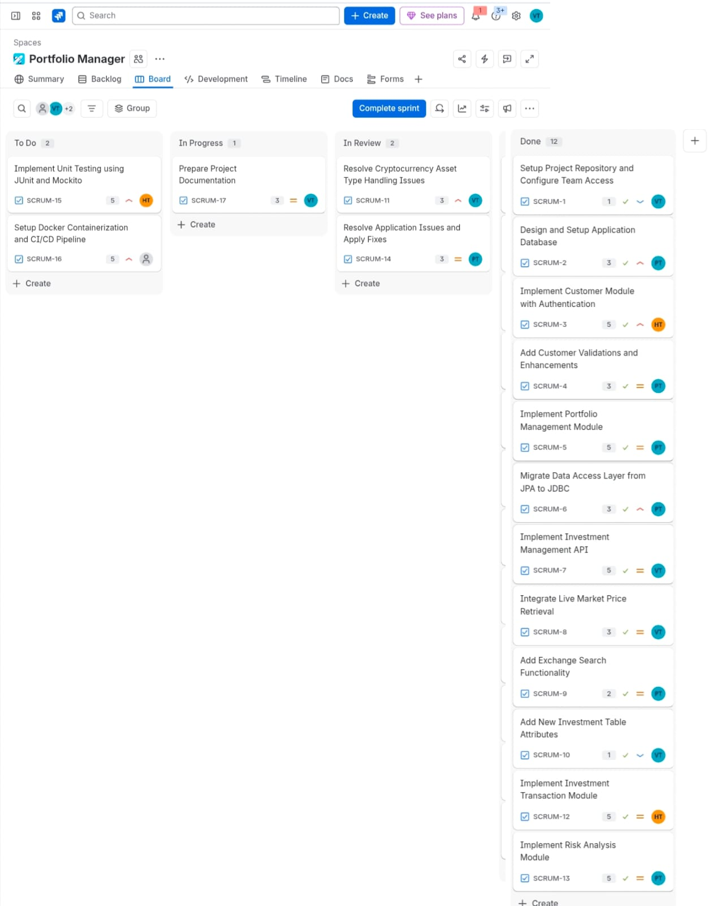
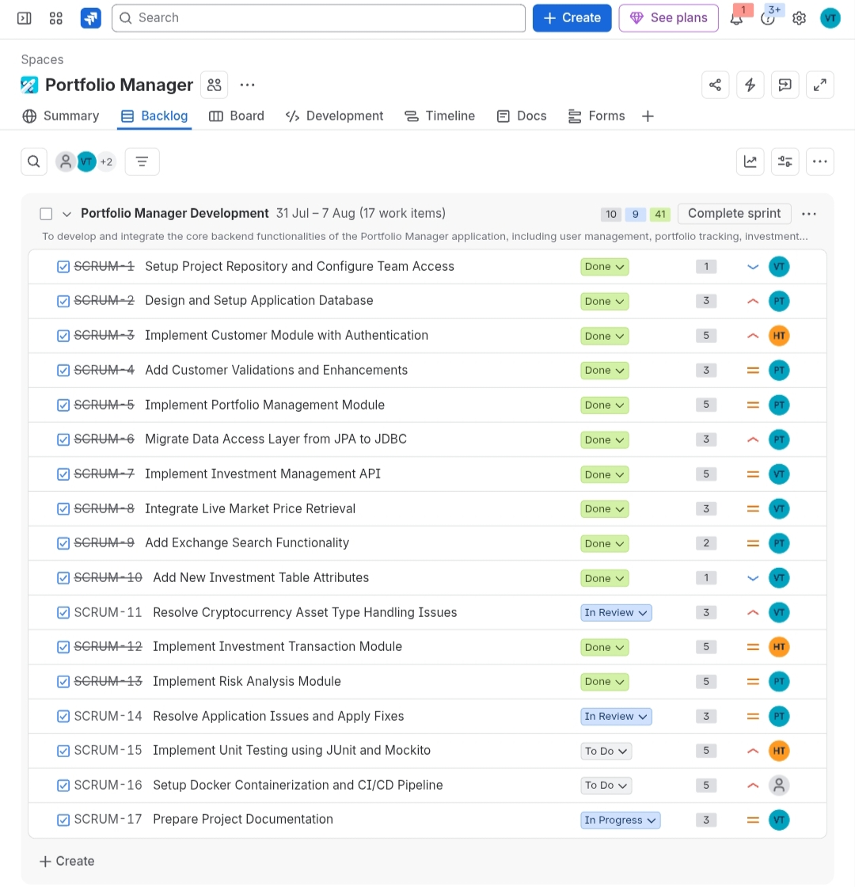
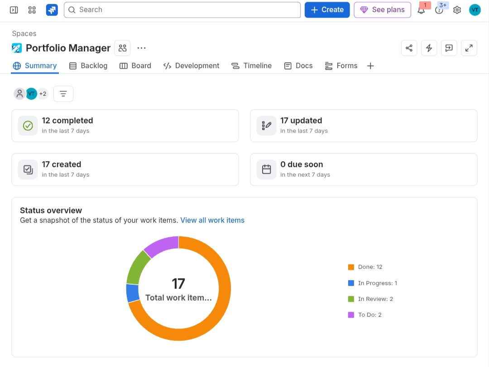

# Project Management - Kanban Board (Jira)

## Board Link
[View live board - Portfolio Manager Development](https://venumadhurithondepu.atlassian.net/jira/software/projects/SCRUM/boards/1?filter=&groupBy=none)

## Sprint Overview
- Sprint: Portfolio Manager Development
- Duration: 31 Jul - 7 Aug (18 work items)
- Goal: To develop and integrate the core backend functionalities of the Portfolio Manager application, including user management, portfolio tracking, and investment operations.

## Board View (All Columns)
To Do -> In Progress -> In Review -> Done

## Board Snapshots

### Kanban Board

### Backlog

### Work Items

## Workflow
The team used a 4-column Kanban workflow: To Do -> In Progress -> In Review -> Done. Each card is linked to a SCRUM ticket carrying a story-point estimate and an assignee; tickets move right as work progresses, with a review gate before being marked Done.

